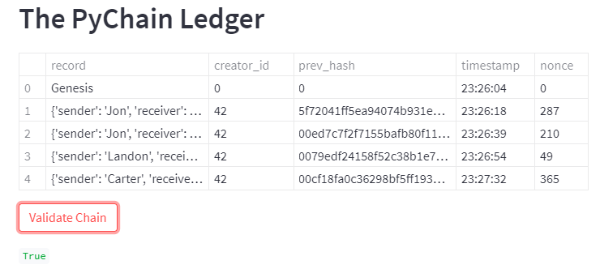
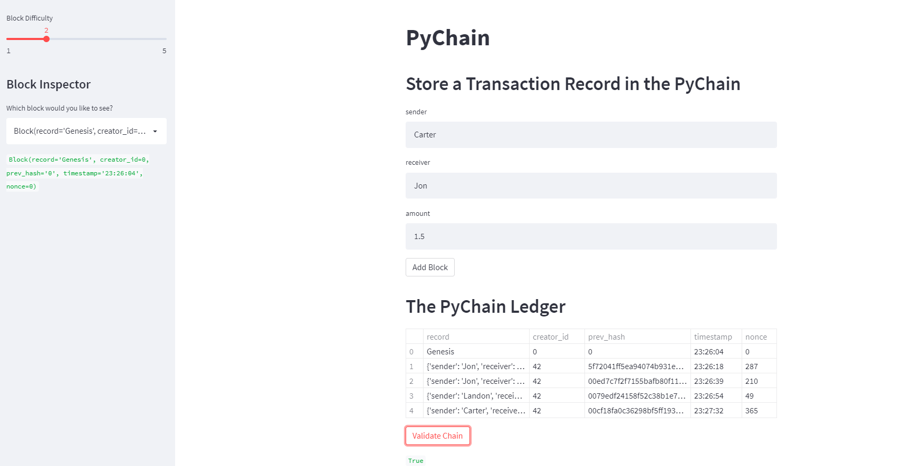

# PyChain Ledger
The Unit 18 Blockchain homework, PyChain Ledger, provided an opportunity to demonstrate how the blockchain works, displaying transactions in a block and the validation of the block. This was displayed using Streamlit. 
## Block Contents and Hashes:

## Validation on the Blockchain

## PyChain Ledger Displayed with Streamlit

